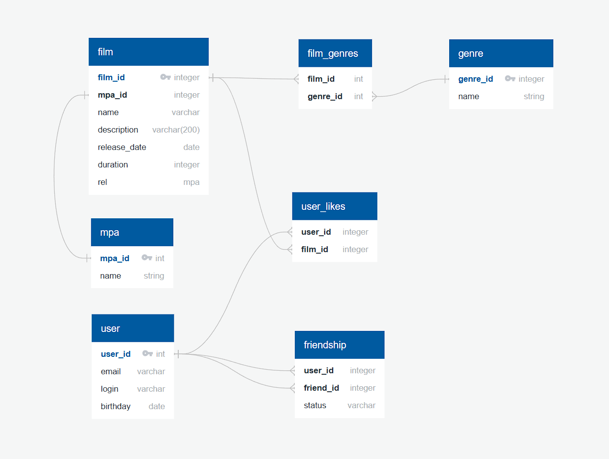

# Схема базы данных


# Основные таблицы

* user — пользователи
* film — фильмы
* mpa — рейтинги MPA
* genre — жанры
* film_genres — связь фильмов с жанрами
* user_likes — лайки пользователей фильмов
* friendship — дружба между пользователями

# Примеры запросы

### 1. Все фильмы с рейтингом PG-13
```
SELECT f.name
FROM film as f
LEFT JOIN film_genres AS fg ON f.film_id = fg.film_id
LEFT JOIN genre AS g ON g.film_id = f.film_id
WHERE g.name = 'PG-13'
``` 
### 2. Все подтверждённые друзья 1-го пользователя
```
SELECT u.*
FROM user AS u
LEFT JOIN friendship AS f ON u.id = f.friend_id
WHERE f.user_id = 1 AND f.status = 'CONFIRMED';
```
### 3. 10 самых популярных фильмов
```
SELECT f.name, COUNT(l.user_id) AS likes
FROM film AS f
LEFT JOIN user_likes AS ul ON f.id = ul.film_id
GROUP BY f.id
ORDER BY likes DESC
LIMIT 10;
```

### 4. Все жанры 1-го фильма
```
SELECT g.name
FROM film AS f
LEFT JOIN film_genres AS fg ON f.id = fg.film_id
LEFT JOIN genre AS g ON fg.genre_id = g.id
WHERE f.id = 1;
```